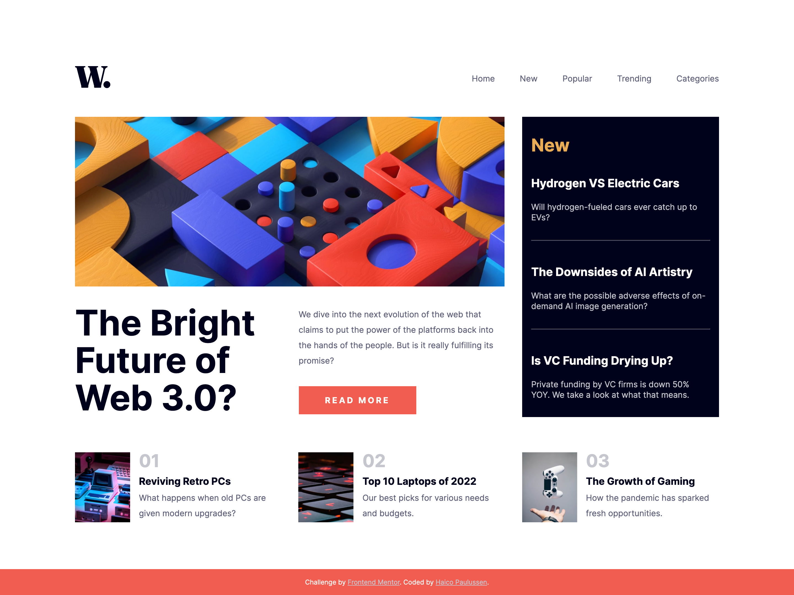

# Frontend Mentor - Advice generator app solution

This is a solution to the [News homepage challenge on Frontend Mentor](https://www.frontendmentor.io/challenges/news-homepage-H6SWTa1MFl). Frontend Mentor challenges help you improve your coding skills by building realistic projects.

## Table of contents

- [Overview](#overview)
  - [The challenge](#the-challenge)
  - [Screenshot](#screenshot)
- [My process](#my-process)
  - [Built with](#built-with)
- [Author](#author)

## Overview

### The challenge

Users should be able to:

- View the optimal layout for the interface depending on their device's screen size
- See hover and focus states for all interactive elements on the page

### Screenshot

### Links

- Solution URL: [Frontend Mentor solution](https://www.frontendmentor.io/solutions/marvel-quote-generator-with-marvel-api-and-css-grid-ArgjFDjX3S)
- Live Site URL: [Github Pages](https://haico-paulussen.github.io/news-homepage-challenge/)

## My process

### Built with

- Semantic HTML5 markup
- Flexbox
- CSS Grid
- JavaScript

### Continued development

So right now I learned basic HTML, CSS, Flexbox and CSS Grid. Next step for me is to start learning basic JavaScript so I can work on my long term goal: Learn VUE.js (and/or other frameworks).

## Author

- Frontend Mentor - [@Haico-Paulussen](https://www.frontendmentor.io/profile/Haico-Paulussen)
- LinkedIn - [Haico Paulussen](https://www.linkedin.com/in/haico-paulussen-160281158/)
